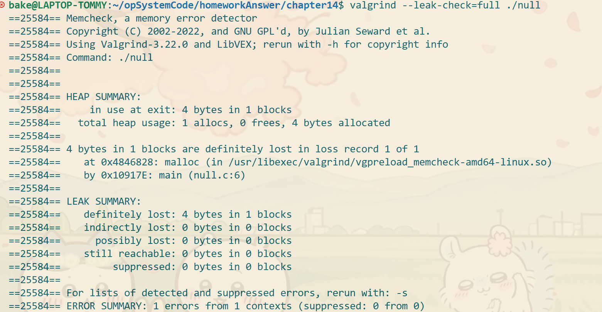
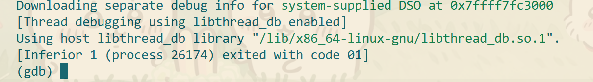
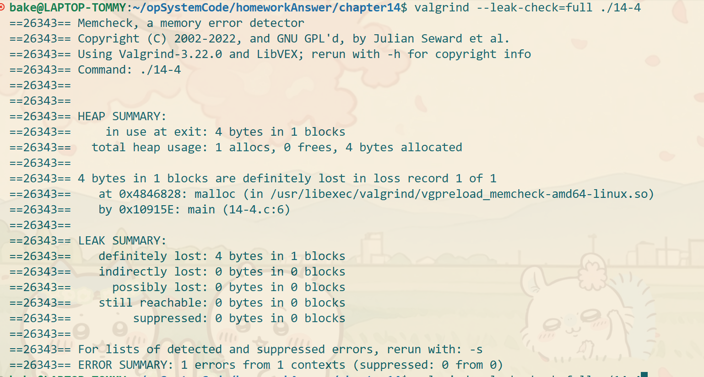
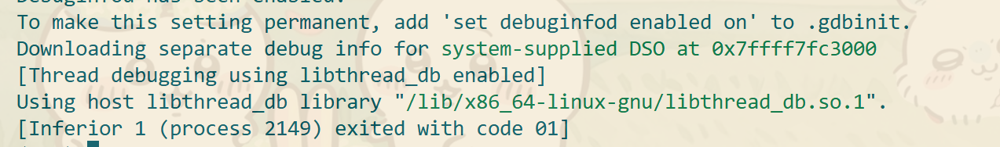
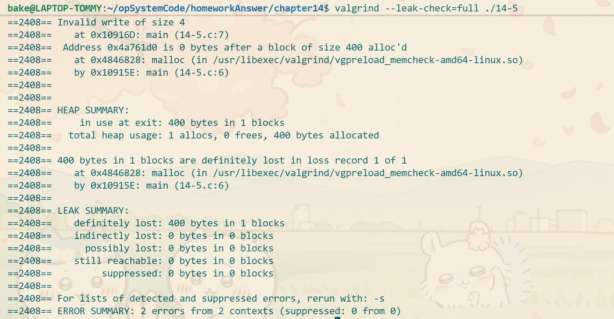
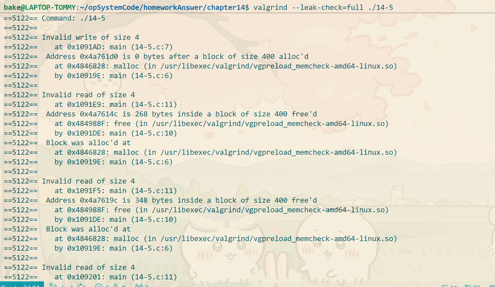
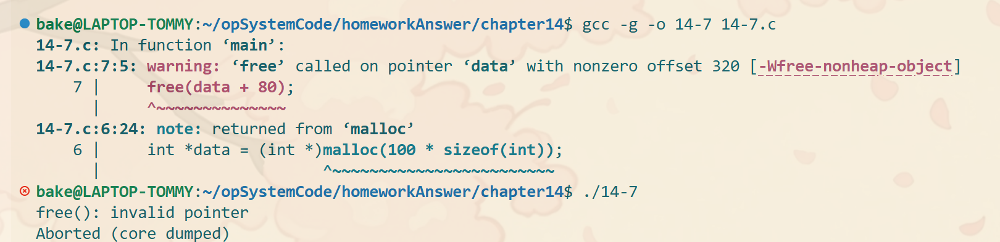
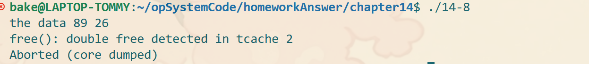
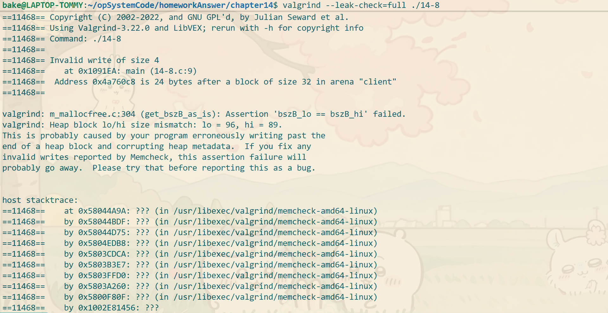

### 第一题
        #include <stdio.h>
        #include <stdlib.h>

        int main()
        {
            int *x = (int *)malloc(sizeof(int)); // 注意此时sizeof是操作符，不是函数调用，因为在编译时就能算出字节大小，不需要运行计算;
            x = NULL;
            free(x);
            return 1;
        }
释放一个nil指针，程序不会崩溃是安全的;

### 第二题

运行gdb没有看出什么

### 第三题

没有发生内存泄漏的情况

### 第四题

没什么异常

检测到了内存泄漏1 alloc 0 free

### 第五题

无任何问题，程序也能运行

有两个错误，写入错误和内存泄漏；

### 第六题
        #include <stdio.h>
        #include <stdlib.h>

        int main()
        {
            int *data = (int *)malloc(100 * sizeof(int));
            data[100] = 0;
            data[87] = 1;
            data[67] = 98;
            free(data);
            printf("the data %d %d %d\n", data[100], data[87], data[67]);
            return 1;
        }

3个读取错误1个输入错误;

### 第7题
        #include <stdio.h>
        #include <stdlib.h>

        int main()
        {
            int *data = (int *)malloc(100 * sizeof(int));
            free(data + 80);
            printf("the data %d %d %d\n", data[100], data[87], data[67]);
            return 1;
        }

直接不能运行

### 第8题
        #include <stdio.h>
        #include <stdlib.h>

        int main()
        {
            int *data = (int *)malloc(4 * sizeof(int));
            data[0] = 26;
            int *data1 = (int *)realloc(data, 20);
            data1[14] = 89;
            printf("the data %d %d\n", data1[14], data1[0]);
            free(data);
            free(data1);
            return 1;
        }

