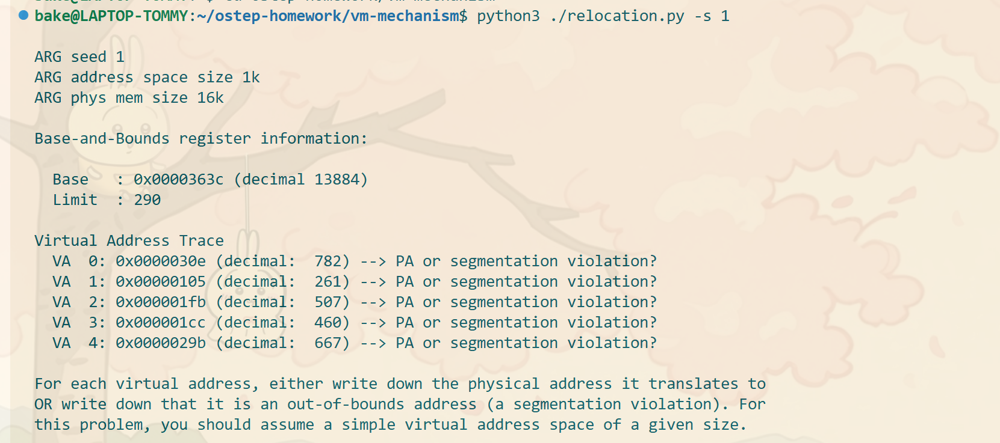
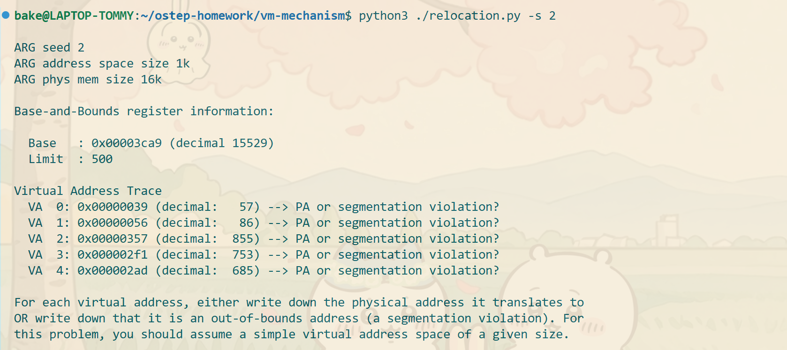
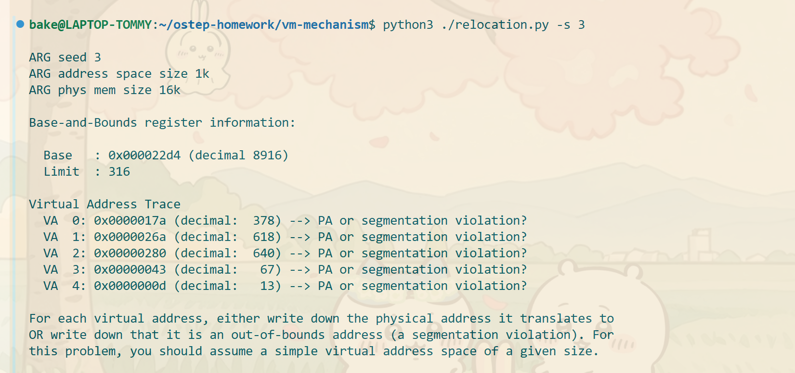
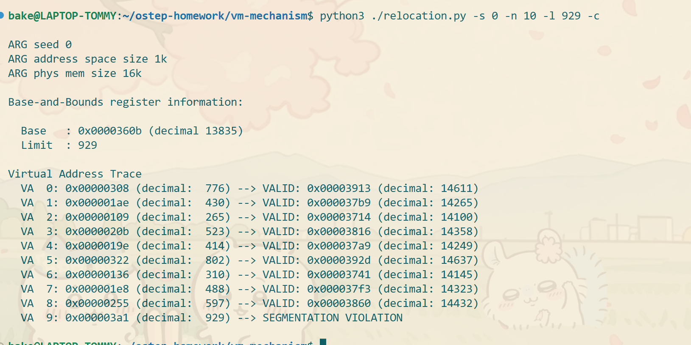
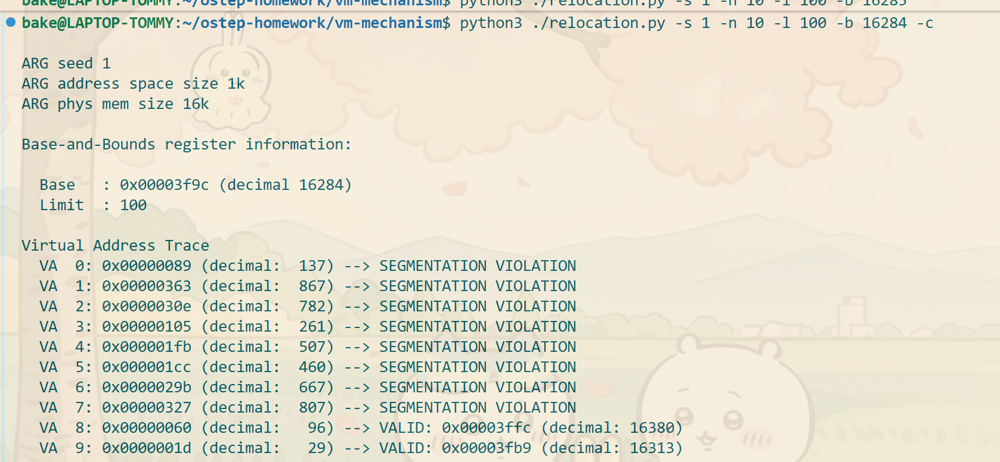

### 第一题

描述：VA 0的地址是超过的界限寄存器的所以是segmentation violation
VA 1的physical address 是：0x00003741(decimal:14145)
VA2:segmentation violation
VA3:segmentation violation
VA4 segmentation violation 

VA 0: PA:0x00003ce2 (decimal:15586)
VA 1: PA:0x00003cff (demical:15615)
VA 2:segmentation violation
VA 3:segmentation violation
VA 4:segmentation violation

VA 0: sementation violation
VA 1: segmentation violation
VA 2: segmentation violation
VA 3: PA: 0x00002317 (decimal:8983)
VA 4: PA: 0x000022e1 (decimal:8929)

### 第二题

为了确保所有的虚拟地址都在边界中，界限寄存器的值最小是930;界限寄存器的值是范围
比如说929说什么虚拟地址范围是0-928一共有929个可用字节，而不是最后一个可用地址

### 第三题
题目翻译错误，是问基址的最大值是多少

16K-100=16284

### 第五题
生成的虚拟地址必须小于界限寄存器的值才是有效的

