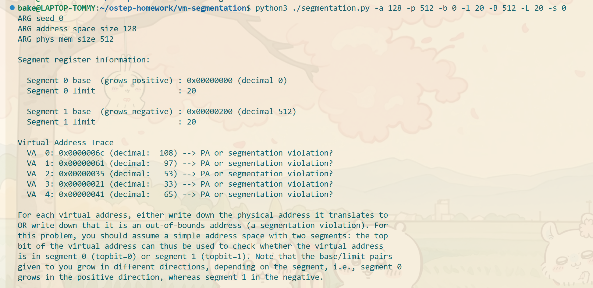
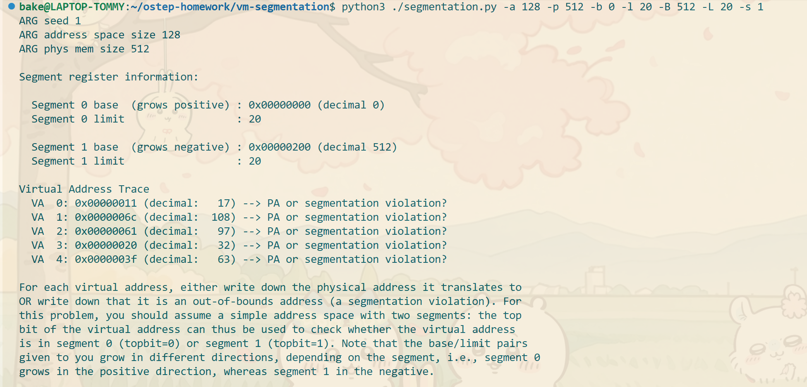
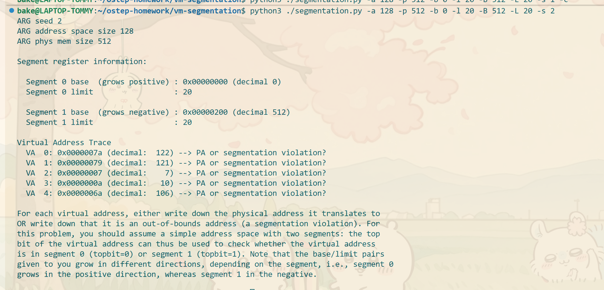
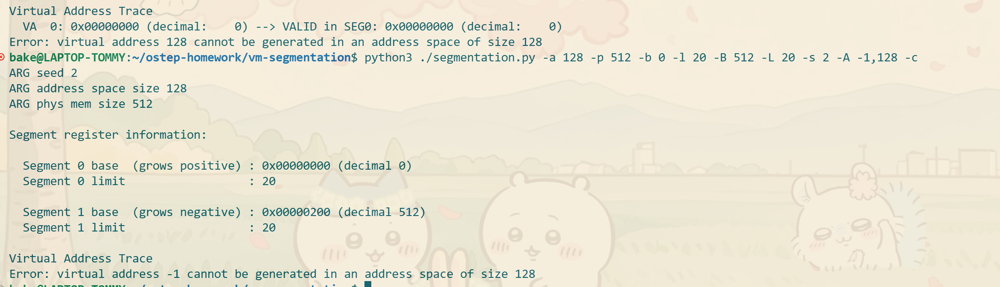
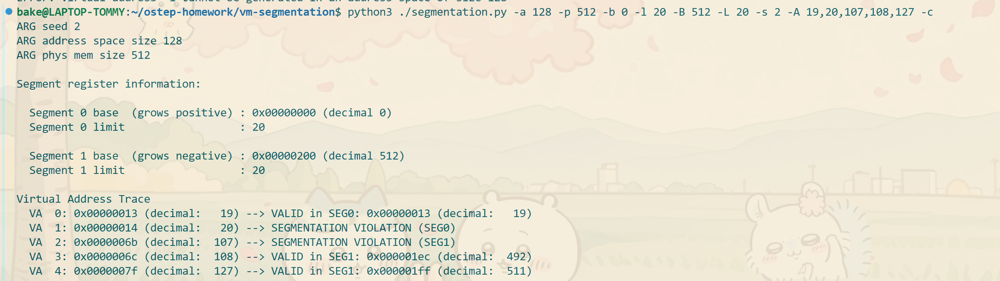
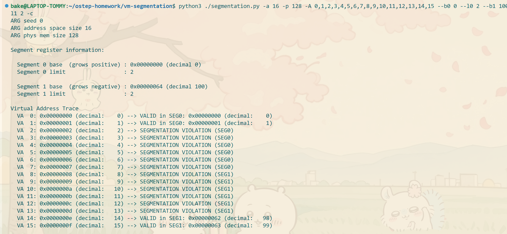

### 第一题

VA 0: VALID IN SEG1:0x000001ec (decimal:492)
VA  1: 0x00000061 (decimal:   97) --> SEGMENTATION VIOLATION (SEG1)
VA  2: 0x00000035 (decimal:   53) --> SEGMENTATION VIOLATION (SEG0)
VA  3: 0x00000021 (decimal:   33) --> SEGMENTATION VIOLATION (SEG0)
VA  4: 0x00000041 (decimal:   65) --> SEGMENTATION VIOLATION (SEG1)

VA  0: 0x00000061 (decimal:   17) --> VALID in SEG0: 0x00000011 (decimal:   17)
VA  1: 0x0000006c (decimal:   108) --> VALID IN SEG1:0x000001ec (decimal:492)
VA  2: 0x00000061 (decimal:   97) --> SEGMENTATION VIOLATION (SEG1)
VA  3: 0x00000020 (decimal:   32) --> SEGMENTATION VIOLATION (SEG0)
VA  4: 0x0000003f (decimal:   63) --> SEGMENTATION VIOLATION (SEG0)

VA  0: 0x00000007a (decimal:   122) --> VALID in SEG1: 0x000001fa (decimal:   506)
VA  1: 0x000000079 (decimal:   121) --> VALID in SEG1: 0x000001f9 (decimal:   505)
VA  2: 0x000000007 (decimal:   7) --> VALID in SEG0:   0x00000007 (decimal:   17)
VA  3: 0x00000000a (decimal:   10) --> VALID in SEG0:  0x0000000a (decimal:   10)
VA  4: 0x00000006a (decimal:   106) --> SEGMENTATION VIOLATION (SEG1)

### 第二题

段0的最高合法虚拟地址是19，段1的最低合法虚拟地址是107；在整个地址空间中，最低的非法地址是-1
最高的非法地址是128

### 第三题

前两个和组后两个有效，说明界限寄存器的值是2，对于SEG0来说基址必须是0，SEG1的基址随便都都行

### 第四题
两个界限寄存器的和是地址空间的90%就行，同时样本也需要增大
`python3 ./segmentation.py -a 2k -n 100 --b0 0 --l0 920 --l1 921 -c`

### 第五题
两个界限寄存器的值都是0就行了

