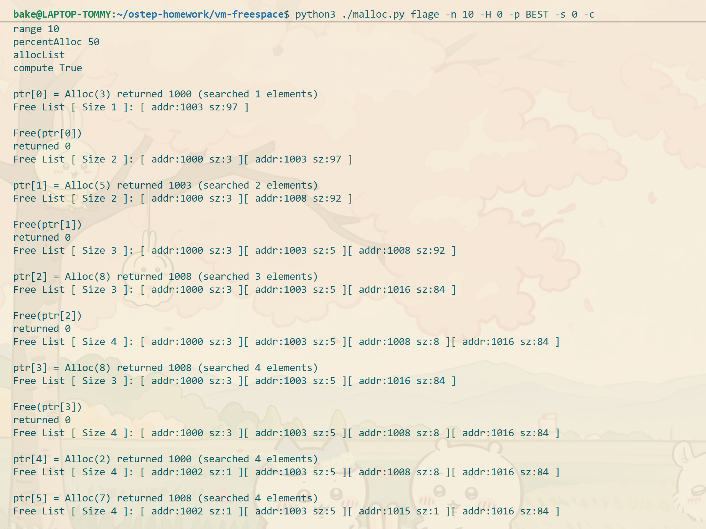
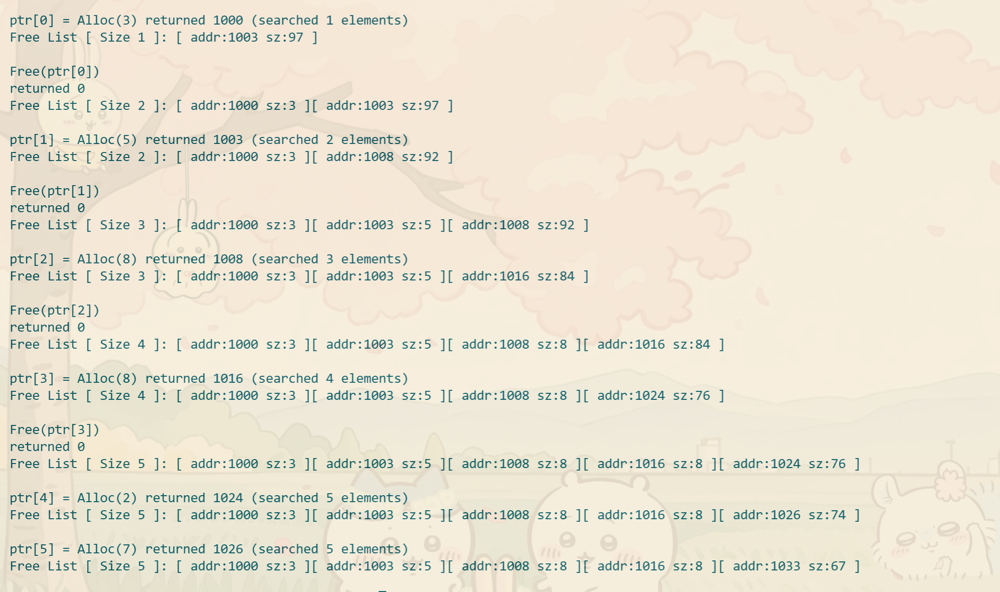
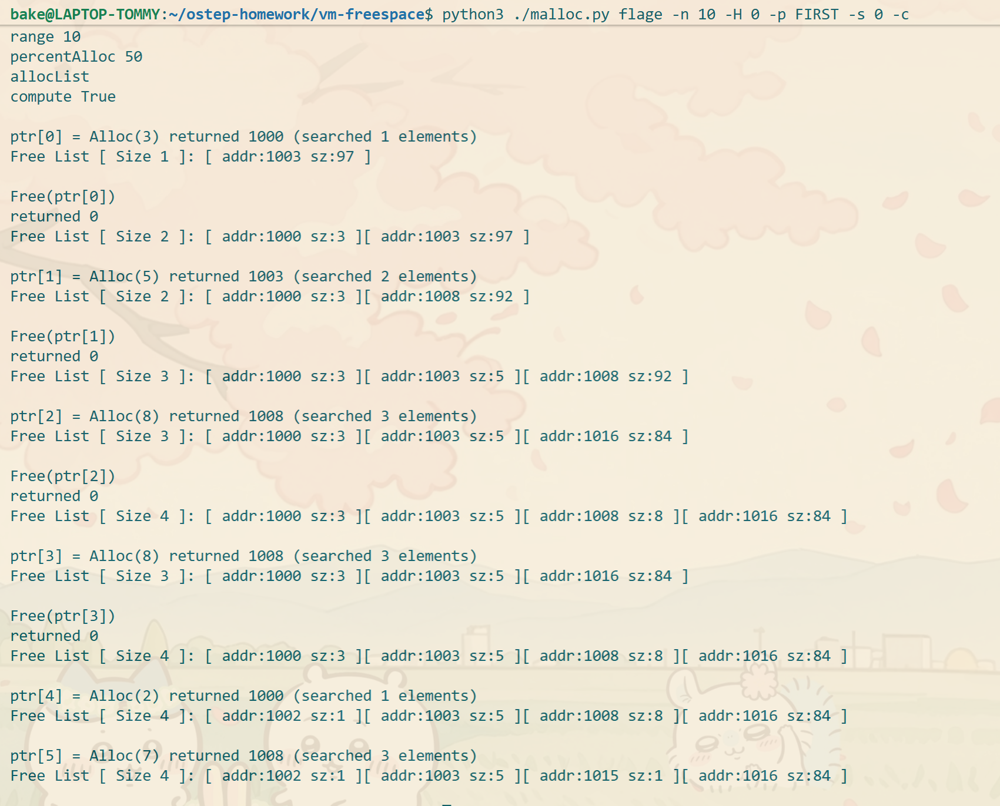
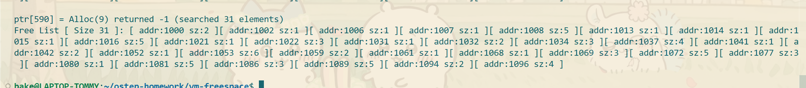
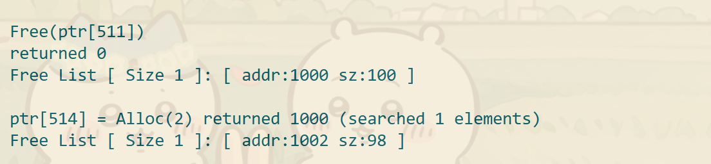

### 第一题

空闲列表中的内存碎片，会因为持续不断的分割越来越多(即使找到了最小最大内存块，也会继续分割刚好满足申请大小)

### 第二题

使用最差匹配原则，总是用最大块内存，导致更多内存碎片产生

### 第三题

使用首次匹配原则，返回地址的速度变快了，因为遍历的次数少了

### 第四题
针对首次匹配策略，使用SIZESORT-的顺序，提高了返回地址时间，但是也增加了内存碎片
针对最差匹配和最优匹配原则,不受空闲列表顺序影响

### 第五题

不合并列表的话，在大型分配请求下，会产生大量内存碎片，即使总空闲内存满足申请大小，也会内存不足无法满足请求

合并列表后，没有产生大量的内存碎片

### 第六题
在大量分配不释放操作下，很快内存不足，无法满足请求