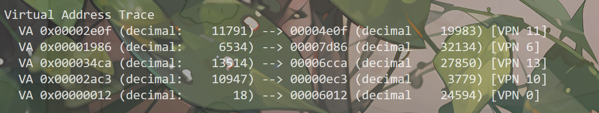

### 第一题
1.1线性表随地址空间大小的变化：
./paging-linear-translate.py -P 1k -a 1m -p 512m -v -n 0 页表项索引[0-1023] 2^10
./paging-linear-translate.py -P 1k -a 2m -p 512m -v -n 0 页表项索引[0-2047] 2^20
./paging-linear-translate.py -P 1k -a 4m -p 512m -v -n 0 页表项索引[0-4098] 2^40
线性表随着地址空间的2^(n)倍增加而增加，比如2^10->2^20扩大了2^10倍，所以线性表也增大了2^10倍

1.2线性表随页的大小变化：
./paging-linear-translate.py -P 1K -a 1m -p 512m -v -n 0 页表项索引[0-1023] 2^10
./paging-linear-translate.py -P 2K -a 1m -p 512m -v -n 0 页表项索引[0-511] 2^9
./paging-linear-translate.py -P 4K -a 1m -p 512m -v -n 0 页表项索引[0-255] 2^8
线性表随着页的2^(n)倍增加而缩小2^n倍，比如页从2^10->2^11扩大了2^1，线性表增大了2^1;

1.3 为什么不用大页
大页的优点是减少了外部碎片，提高了TLB覆盖范围，减少了页表体积；但是缺点是增加了内部碎片分配和程序过大的内存空间
小页的优点是减少内部碎片；但缺点是页表体积大，TLB命中不高；

### 第二题
`./paging-linear-translate.py -P 1k -a 16k -p 32k -v -u 0`

`./paging-linear-translate.py -P 1k -a 16k -p 32k -v -u 25` 

`./paging-linear-translate.py -P 1k -a 16k -p 32k -v -u 50`

`./paging-linear-translate.py -P 1k -a 16k -p 32k -v -u 75`

`./paging-linear-translate.py -P 1k -a 16k -p 32k -v -u 100`

增加页的大小的话,会减少页表项(PTE),越来越多的指令在同一个PTE中

### 第三题
三个组合都能转换地址，只是有的参数不合理；
第一个和第二个的页太少了只有4个
第三个的页又太大了

