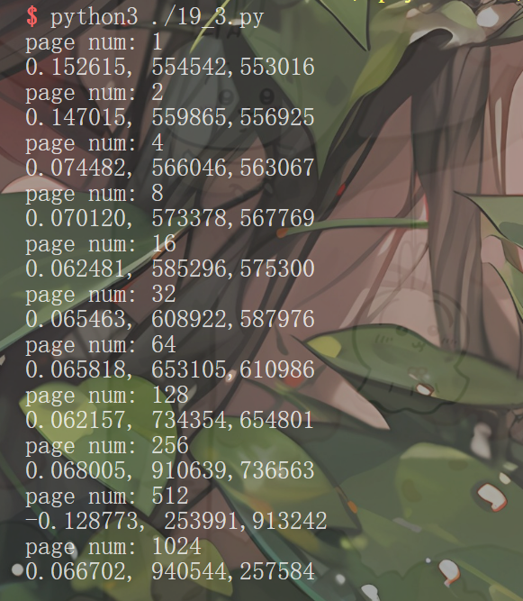

### 第一题
        /*方案因为一次循环就很快，我们执行N次循环，算出执行一次循环时间，再用一次循环的意思/假设的页数，得到每个页的平均访问开销*/
        #include <stdio.h>
        #include <stdlib.h>
        #include <sys/time.h>

        #define PAGE_SIZE 4096  /*页大小:4KB*/
        #define NUMBERPAGE 1024 /*假设TLB的大小*/
        #define NUMBER 30000000
        int jump = PAGE_SIZE / sizeof(int); /*1页能存多少个Int类型*/

        struct timeval start, end;

        int main(int argc, char *argv[])
        {
            int a[NUMBERPAGE * jump];
            gettimeofday(&start, NULL);
            for (int j = 0; j < NUMBER; ++j)
            {
                for (int i = 0; i < NUMBERPAGE * jump; i += jump)
                {
                    a[i] += 1;
                }
            }
            gettimeofday(&end, NULL);
            printf("the all times to read TLB :%.6f, %d,%d", ((double)end.tv_sec - start.tv_sec) / NUMBER, end.tv_sec, start.tv_sec);
            return 0;
        }

本机器的页大小是4KB，由于gettimeofday的tv_usec是微秒,本身就难以计算访问内存页,循环次数过多：
使用秒级tv_sec会因为循环次数过大导致时间过长,或者循环次数不大造成精度损失计算结果不准确;

### 第二题
        #define _GNU_SOURCE
        #include <pthread.h>
        #include <stdio.h>
        #include <stdlib.h>
        #include <errno.h>
        #include <immintrin.h>
        #include <sys/time.h>

        #define PAGE_SIZE 4096
        #define handle_error_en(en, msg) \
            do                           \
            {                            \
                errno = en;              \
                perror(msg);             \
                exit(EXIT_FAILURE);      \
            } while (0);

        int jump = PAGE_SIZE / sizeof(int);
        struct timeval start, end;

        int main(int argc, char *argv[])
        {
            if (argc != 3)
            {
                fprintf(stderr, "on right arguments");
                exit(1);
            }
            int s;
            cpu_set_t cpuset;
            pthread_t thread;

            thread = pthread_self(); // 获取当前运行的线程数据结构
            CPU_ZERO(&cpuset);
            CPU_SET(3, &cpuset);

            /*set CPU affinity of a thread*/
            s = pthread_setaffinity_np(thread, sizeof(cpuset), &cpuset);
            if (s != 0)
            {
                handle_error_en(s, "phtread_setaffinity_np");
            }
            /* Check the actual affinity mask assigned to the thread */
            s = pthread_getaffinity_np(thread, sizeof(cpuset), &cpuset);
            if (s != 0)
            {
                handle_error_en(s, "phtread_getaffinity_np");
            }

            int NUMBERPAGE = atoi(argv[1]);
            int NUMBER = atoi(argv[2]);
            int a[NUMBERPAGE * jump];

            gettimeofday(&start, NULL);
            for (int j = 0; j < NUMBER; ++j)
            {
                for (int i = 0; i < NUMBERPAGE * jump; i += jump)
                {
                    a[i] += 1;
                    // 删除缓存避免下次循环缓存干扰没有测试出TLB缺失
                    _mm_clflush(&a[i]);
                }
            }
            gettimeofday(&end, NULL);
            printf("%lf, %.6ld,%.6ld \n", (((double)end.tv_usec - start.tv_usec) / NUMBER) / NUMBERPAGE, end.tv_usec, start.tv_usec);
            return 0;
        }
第一次遍历会把数组数据加载到缓存(Cache)中，
如果不使用清除缓存(Cache)，下次循环的情况下直接缓存命中，算出的时间就是缓存命中的平均时间2-6ns，
而不是正常TLB未命中遍历页表,典型的内存访问延迟范围（DRAM 访问约 50~100 纳秒，加上页表遍历开销后可能更高）

### 第三题
        #! /usr/bin/env python
        import os

        i = 1
        while i < 3000:
            print("page num:",i)
            val = os.system('./19_2 '+str(i)+' '+str(10000))
            i *=2

### 第四题
使用matplotib画图

512页出现负数的原因是描述sec已经超过1秒微秒清空从0开始计算，所以结束时间比开始时间短导致负数

### 第五题
编译时使用 -o0方式编译器优化

### 第六题
使用pthread_setaffinity_np 和 pthread_getaffinity_np 绑定进程只在一个CPU上，如果
在不同的CPU，新的TLB状态是全失效，增加内存访问

### 第七题
        #define _GNU_SOURCE
        #include <pthread.h>
        #include <stdio.h>
        #include <stdlib.h>
        #include <errno.h>
        #include <immintrin.h>
        #include <sys/time.h>

        #define PAGE_SIZE 4096
        #define handle_error_en(en, msg) \
            do                           \
            {                            \
                errno = en;              \
                perror(msg);             \
                exit(EXIT_FAILURE);      \
            } while (0);

        int jump = PAGE_SIZE / sizeof(int);
        struct timeval start, end;

        int main(int argc, char *argv[])
        {
            if (argc != 3)
            {
                fprintf(stderr, "on right arguments");
                exit(1);
            }
            int s;
            cpu_set_t cpuset;
            pthread_t thread;

            thread = pthread_self(); // 获取当前运行的线程数据结构
            CPU_ZERO(&cpuset);
            CPU_SET(3, &cpuset);

            /*set CPU affinity of a thread*/
            s = pthread_setaffinity_np(thread, sizeof(cpuset), &cpuset);
            if (s != 0)
            {
                handle_error_en(s, "phtread_setaffinity_np");
            }
            /* Check the actual affinity mask assigned to the thread */
            s = pthread_getaffinity_np(thread, sizeof(cpuset), &cpuset);
            if (s != 0)
            {
                handle_error_en(s, "phtread_getaffinity_np");
            }

            int NUMBERPAGE = atoi(argv[1]);
            int NUMBER = atoi(argv[2]);
            int a[NUMBERPAGE * jump];

            for (int i = 0; i < NUMBERPAGE * jump; i += jump)
            {
                a[i] += 0;
            }

            gettimeofday(&start, NULL);
            for (int j = 0; j < NUMBER; ++j)
            {
                for (int i = 0; i < NUMBERPAGE * jump; i += jump)
                {
                    a[i] += 1;
                    // 删除缓存避免下次循环缓存干扰没有测试出TLB缺失
                    _mm_clflush(&a[i]);
                }
            }
            gettimeofday(&end, NULL);
            printf("%lf, %.6ld,%.6ld \n", (((double)end.tv_usec - start.tv_usec) / NUMBER) / NUMBERPAGE, end.tv_usec, start.tv_usec);
            return 0;
        }

在循环内存访问前初始化确实会减少第一次初始化的开销，Numberage=1从未初始化153->124