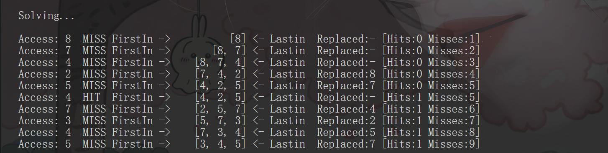
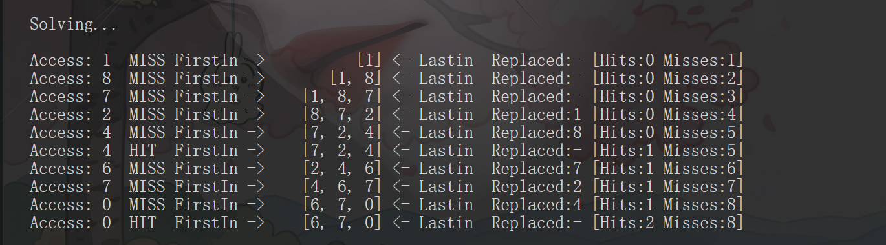
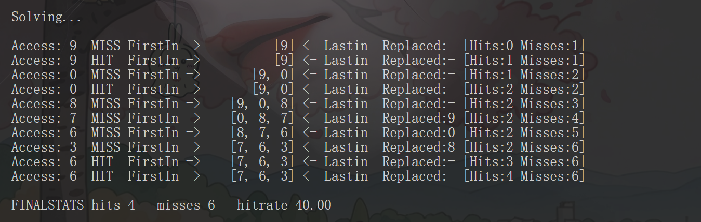

### 第一题
FIFO:

LRU:

opt:

### 第二题
使用序列1,2,3,4,5,6
超出内存序列的会发生抖动即不停换页
面对循环访问该序列，至少增加缓存到该序列的个数

### 第三题
        #! /usr/bin/env python
        import random
        num = 10
        arr = []

        for j in range(1,10):
            i = random.randint(0,num)
            arr.append(i)

        file = open('/home/bake/ostep-homework/vm-beyondphys-policy/1.txt','w')

        for j in arr:
            file.write(str(j)+'\n')

        file.close()
面对无局部性追踪,LRU,FIFO的效果和图22.2效果一样随缓存大小增加

### 第四题
        #! /usr/bin/env python
        import random
        num = 10
        CanRat = 0.8
        MAX = 10
        arry = []

        hotPage = set()
        coldPage = set()
        numLlist = set(range(0,MAX))

        while len(coldPage) < (MAX*CanRat):
            i = random.choice(list(numLlist))
            coldPage.add(i)

        hotPage = numLlist - coldPage

        for r in range(0,num):
            if (random.random()>CanRat): # 20%时间
                t = random.choice(list(coldPage))
            else:
                t = random.choice(list(hotPage))
            arry.append(t)

        file = open('/home/bake/ostep-homework/vm-beyondphys-policy/1.txt','w')

        for j in arry:
            file.write(str(j)+'\n')

        file.close()
结果和图局部性追踪无异

### 第五题
上面的英文+数字 表示内存引用过程
下面的对内存引用结果进行总结
