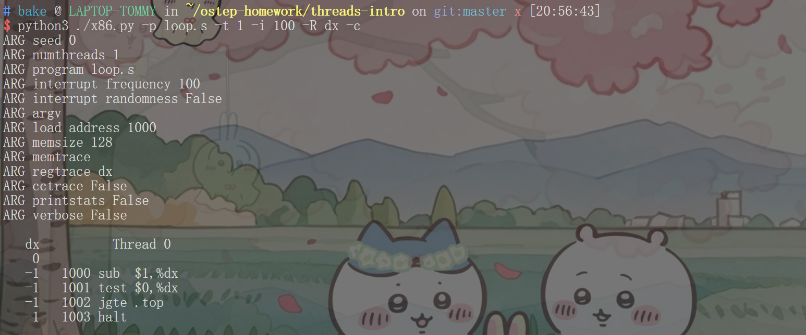
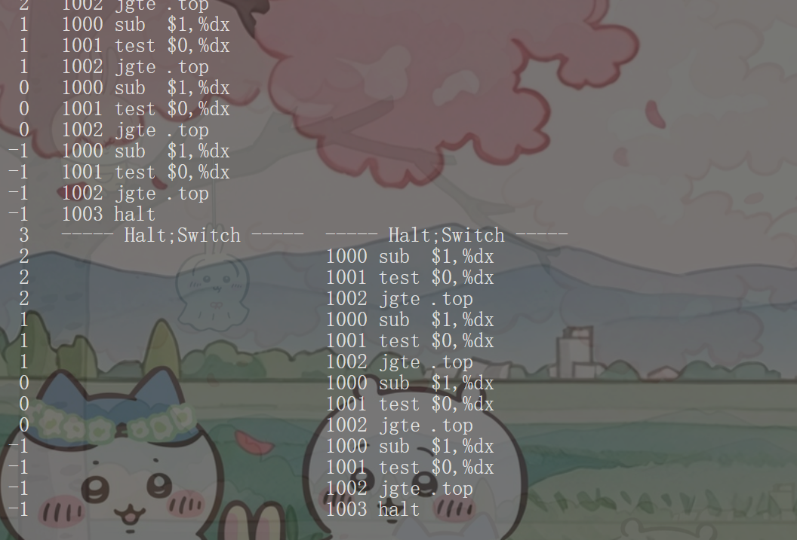
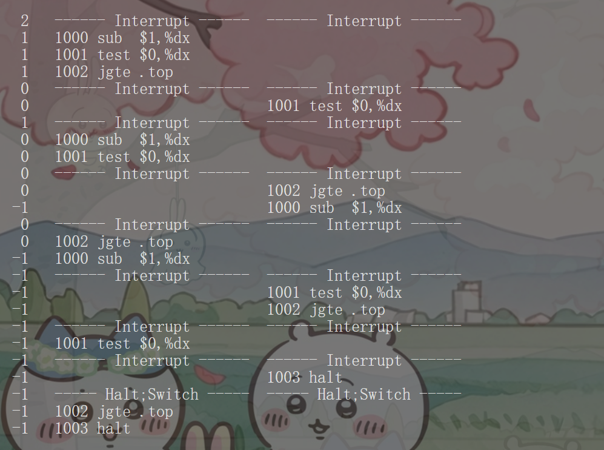
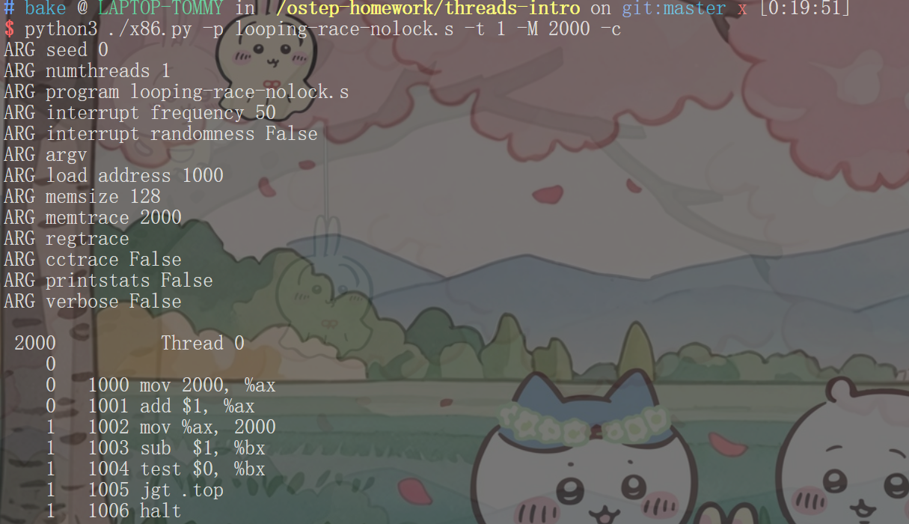
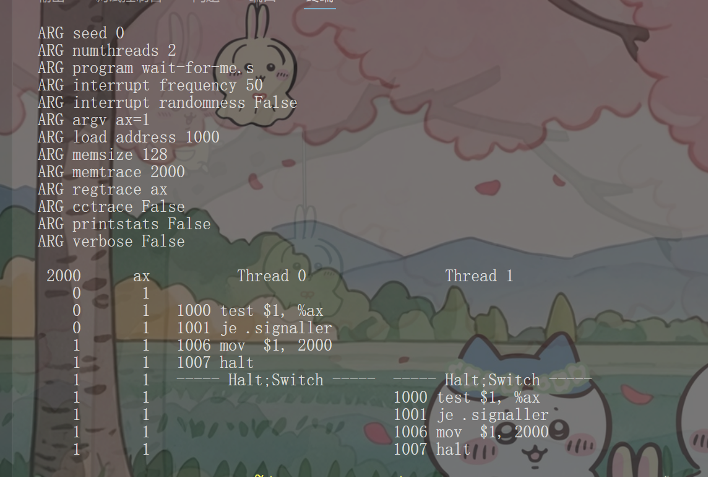
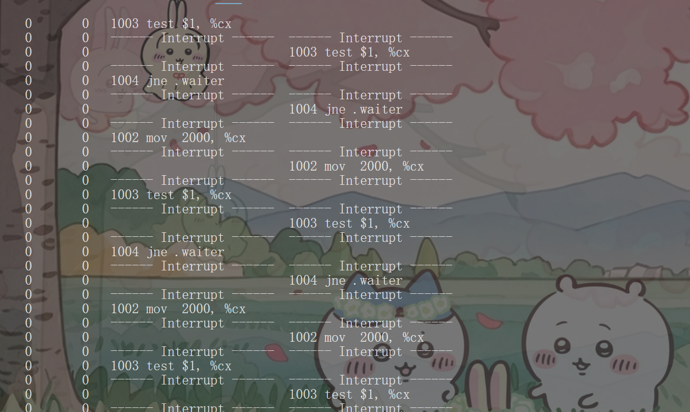

### 第一题

### 第二题

虽然多个线程存在，但没有访问共享资源所以不存在竞态条件
### 第三题

中断频率不会改变程序的这个行为
### 第四题

### 第五题

每个线程循环3次的原因是dx寄存器里的值>0满足跳转条件
### 第六题
在竞态条件下，中断位置发生在完成临界区后是安全的
临界区:1000 mov 2000, %ax
      1001 add $1, %ax
      1002 mov %ax, 2000

### 第七题
对于-i 3的中断间隔程序才会给出"正确"答案
### 第八题
略
### 第九题

线程0和1共享ax寄存器里的值，访问了临界区，但程序能退出
### 第十题

线程0/1发生了无限循环,线程0/1都在等待寄存器%c的值能和1相等
中断间隔很短,可以高效利用CPU,防止一直等待阻塞的线程占据CPU资源