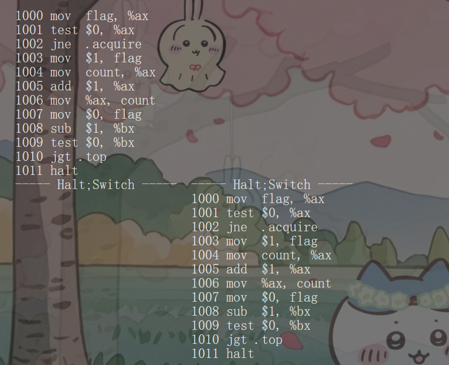
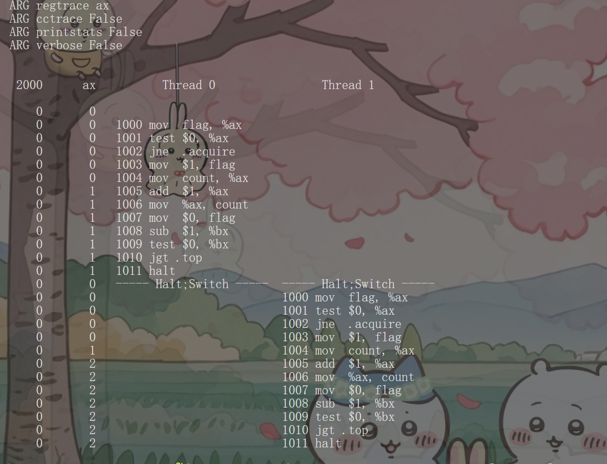
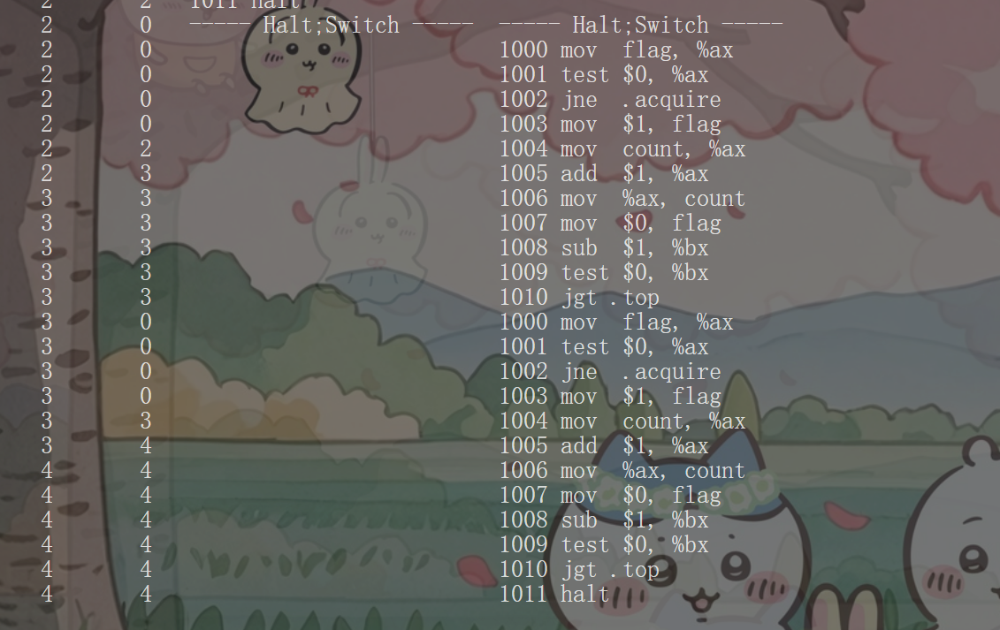
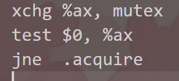
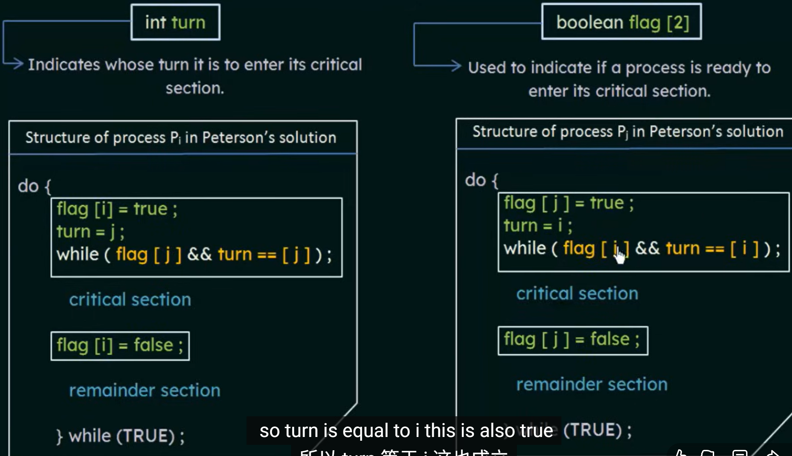

### 第1题

描述：线程0和线程1相继获得一个"锁"
过程:
1.从锁的内存地址获取状态值放在%ax寄存器
2.%ax寄存器里的值和0进行比较是否相等(判断锁的状态)
3.相等说明锁没有被线程占用，线程0获得锁
4.设置锁的状态为1，表明该锁已被线程占用
5.获得锁进入临界区，获得共享变量内存地址的值放入%ax寄存器
6.对%ax寄存器里的值+1
7.把%ax寄存器里的值放入内存地址count中
8.释放锁
9.对%bx寄存器的值-1
10.判断%bx寄存器的值是否>0
11结束线程

### 第2题

### 第3题

本次代码实现了线程的循环，获得了两次锁。因为循环次数不多，且中断位置是在线程结束后，所以没有造成锁饥饿

### 第4题
python3 ./x86.py -p flag.s -M count -R ax  -a bx=5,bx=5 -i 1 -c
python3 ./x86.py -p flag.s -M count -R ax  -a bx=5,bx=5 -i 4 -c
这个中断频率产生不好结果，构造出两个线程同时拥有锁对临界区修改覆盖的情况，不满足互斥性
python3 ./x86.py -p flag.s -M count -R ax  -a bx=5,bx=5 -i 10 -c
这个中断频率产生良好的结果
总结:bx值越高(循环越多的情况下)，中断频率越低，越容易出现不好的结果

### 第5题

### 第6题
python3 ./x86.py -p flag.s -M count flag -R ax  -a bx=5,bx=5 -i 1
即使中断频率低，最终结果也没有出错；有时会有CPU使用率不高的情况，因为未获得锁的线程一直在自选比较flag值
查看时间片是否一直在比较flag直接就行 

### 第7题
python3 ./x86.py -p test-and-set.s -M count,mutex -R ax,bx -P 01100 -c   
共享变量部分结果正确

### 第8题

Peterson算法解释：这是一种humbel algorithm 
两个进程之间互相谦让: turn意味着该进程的下一个进行,
flag[]意味着当前进程准备好了进入 critial section
whlie (flag[1-self]=true && turn=1-self); 如果线程pi想进入critical section 但是pj也想进就会陷入hwile循环
让pj进，Pj也是;注意 turn是全局变量，以为只最后的值由最后的线程决定，所以不会发生饥饿问题

### 第9题
python3 ./x86.py -p peterson.s -M turn,count -R bx,cx,fx -a bx=0,bx=1 -i 5
-i 任意值都能实现正常结果

### 第10题
python3 ./x86.py -p peterson.s -M turn,count -R bx,cx,fx -a bx=0,bx=1 -i 5 -P 101010
python3 ./x86.py -p peterson.s -M turn,count -R bx,cx,fx -a bx=0,bx=1 -i 5 -P 000111
python3 ./x86.py -p peterson.s -M turn,count -R bx,cx,fx -a bx=0,bx=1 -i 5 -P 111000
从上到下分别是 线程交替进行(容易出现无互斥性)，线程1等线程0，线程0等线程1，都没有问题

### 第11题
符合本章代码

### 第12题

随着时间的推移,刚释放的线程因为循环重新获取锁票据，但是FAA严格按照FIFO所以当前票号
是最大的，线程花了很多时间自旋等待"叫号"

### 第13题
加入更多线程，会发现自旋的时间更长了

### 第14题
yield确实减少了很多指令，发生在线程未获得锁，没有长时间自旋而是立即取消调度自己
CPU切换下一个线程完成锁释放

### 第15题
主要优势在于减少了总线流量和缓存一致性开销,test-and-set.s 频繁使用xchg原子操作,导致缓存行被频繁修改，并在所有处理器之间产生大量的缓存一致性协议流量（如 MESI 协议中的“写无效”广播）。这会严重降低系统性能，尤其在多核竞争激烈时。
而test-and-test-and-set.s 先试用普通读操作，确定锁空闲才修改公共变量，未获得锁的线程只能进行只读的自旋，不能修改缓存和，减少了缓存一致性协议流量的开销