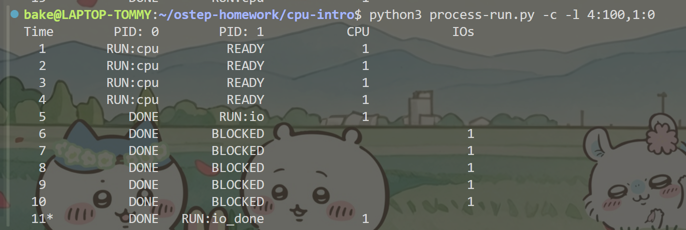
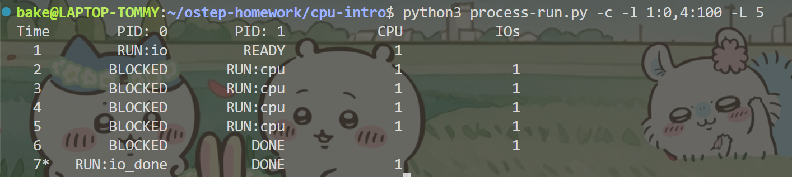
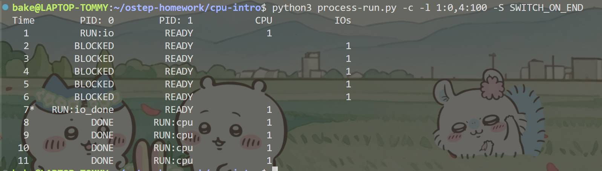
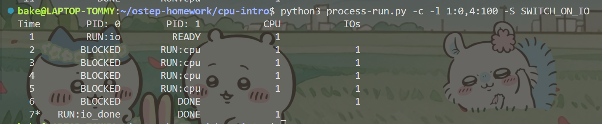
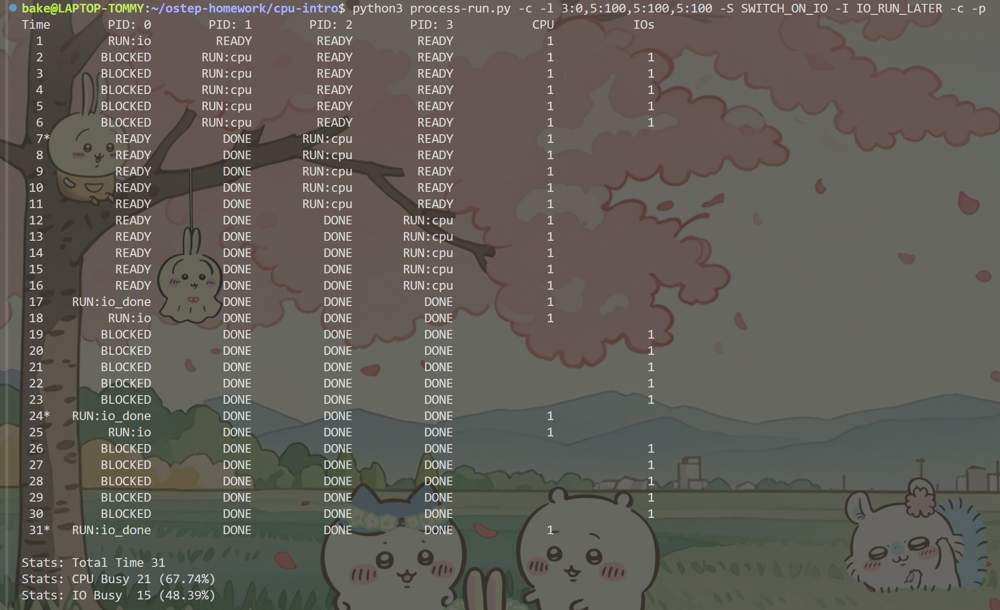
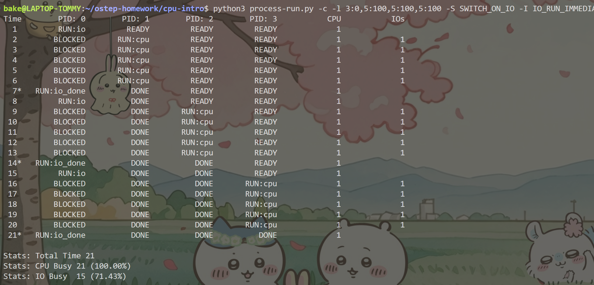
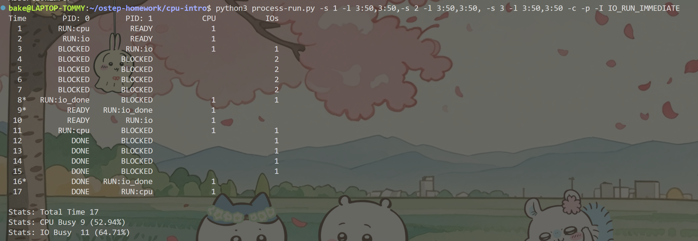
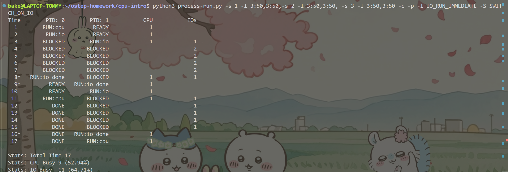

The use radio of CPU is 100%,because two processes run totally run 10 instructions that are divided 5 instruction for one process.Each one instruction uses CPU no issuing IO. 

One process wait other process which issuing an IO needs 11 seconds,because of  an IO finished taking 5 seconds.

PID1 are using CPU when PID0 is waiting IO finished,whether IO before CPU is important,because it decides CPU is used or free.

Now we use option -S SWITCH_ON_END,when PID0 is issuing IO,CPU not change to run PID1,so CPU is free.

Now we use option -S SWITCH_ON_IO,when PID0 is issuing IO,CPU runs PID1,so CPU is used.

If we use -I IO_RUN_LATER,which means IO finished that don't immediately runs the process,until PID1,PID2,PID3 is finishing.

If we use -I IO_RUN_IMMEDIATE,which means IO finished that immediately runs the process, PID1,PID2,PID3 meanwhile use CPU,completing CPU use raio is 100%.

