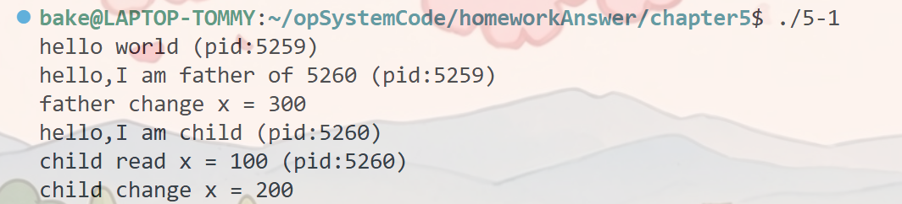
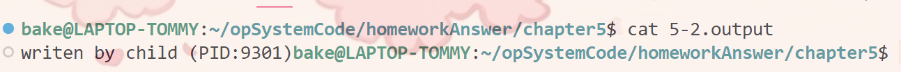
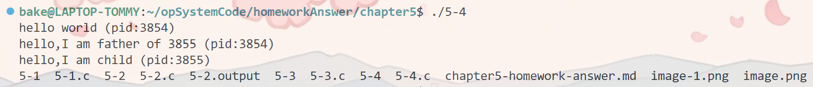
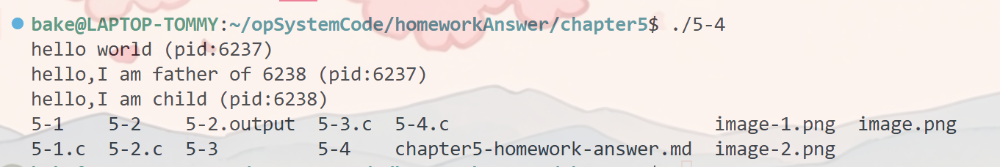
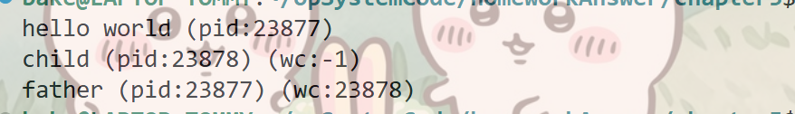

1.答案代码
    #include <stdio.h>
    #include <stdlib.h>
    #include <unistd.h>

    int main(int argc, char *argv[]){
        int x = 100;
        printf("hello world (pid:%d) \n",(int) getpid());
        int rc = fork(); // 调用fork()创建新进程
        if (rc<0){ // fork() failed;exit
            fprintf(stderr,"fork failed\n");
            exit(1);
        } else if (rc == 0){
            printf("hello,I am child (pid:%d)\n",(int) getpid());
            printf("child read x = %d (pid:%d)\n",x,(int) getpid());
            x = 200;
            printf("child change x = %d\n",x);
        } else {
            x = 300;
            printf("hello,I am father of %d (pid:%d)\n",rc,(int) getpid());
            printf("father change x = %d\n",x);
        }
    }
运行答案：

父进程和子进程在不同的地址空间,所以父子进程对X修改不影响对方,表现在父进程对x修改成300后,子进程读取x仍然是100

2.答案代码
    #include <stdio.h>
    #include <stdlib.h>
    #include <unistd.h>
    #include <string.h>
    #include <fcntl.h>
    #include <sys/wait.h>

    int main(int argc, char *argv[]){
        printf("hello world (pid:%d) \n",(int) getpid());
        int rc = fork(); 
        if (rc<0){ // fork() failed;exit
            fprintf(stderr,"fork failed\n");
            exit(1);
        } else if (rc == 0){ // child : redirect standard output to a file
            close(STDOUT_FILENO); // avaliable file description
            open("./5-2.output",O_CREAT|O_WRONLY|O_TRUNC,S_IRWXU); 
            printf("writen by child (PID:%d)",(int) getpid());
        } else {  // parent goes down this path (main)
            close(STDOUT_FILENO);
            open("./5-2.output",O_CREAT|O_WRONLY|O_TRUNC,S_IRWXU);
            printf("hello,I am father of %d (pid:%d)\n",rc,(int) getpid());
        }
        return 0;
    }
运行答案：

父进程和子进程都能访问open()返回的文件描述符,父子进程并发修改，最后子进程的修改覆盖了父进程的修改

3.答案代码
    #include <stdio.h>
    #include <stdlib.h>
    #include <unistd.h>

    int main(int argc, char *argv[]){
        int rc = vfork(); // 让子进程先运行
        if (rc<0){ // fork() failed;exit
            fprintf(stderr,"fork failed\n");
            exit(1);
        } else if (rc == 0){
            printf("child hello (pid:%d)\n",(int) getpid());
        } else {
            printf("goodbye,I am father of %d (pid:%d)\n",rc,(int) getpid());
        }
    }
使用vfork()保证子进程先执行，因为vfork()不复制父进程地址空间，子进程直接共享挂起父进程，直到调用_exit()或exec()执行新程序才退出，保证了子进程先执行

4.答案代码
    #include <stdio.h>
    #include <stdlib.h>
    #include <unistd.h>
    #include <string.h>
    #include <sys/wait.h>

    int main(int argc, char *argv[]){
        printf("hello world (pid:%d) \n",(int) getpid());
        int rc = fork(); 
        if (rc<0){ 
            fprintf(stderr,"fork failed\n");
            exit(1);
        } else if (rc == 0){ // child (new process)
            printf("hello,I am child (pid:%d)\n",(int) getpid());
            char *myargs[3];
            myargs[0] = strdup("/bin/ls"); 
            myargs[1] = NULL; 
            myargs[2] = NULL; 
            execvp(myargs[0],myargs); 
            printf("this shouldn't print pout");
        } else {  // parent goes down this path (main)
            printf("hello,I am father of %d (pid:%d)\n",rc,(int) getpid());
        }
        return 0;
    }
运行答案：
    
使用execl(myargs[0],myargs[0],NULL)运行答案:
    
使用char *env[] = {NULL};execle(myargs[0],myargs[0],NULL,env);运行答案相同,该函数一定要
有环境数组变量指针结尾
使用execlp(myargs[0],myargs[0],NULL);运行答案相同
使用execv(myargs[0],myargs);使用execvpe(myargs[0],myargs,env)运行结果也相同
同样基本调用有这么多变种，对正在启动的进程开启外部进程提供了很大的灵活性:有的可执行文件必须带路路径,有的则不需要系统环境会找到次可执行文件；有的需要自定义环境变量(如果环境变量被更改也只是当前进程的环境变量不会修改系统的环境变量)

5.答案代码
    #include <stdio.h>
    #include <stdlib.h>
    #include <unistd.h>
    #include <string.h>
    #include <sys/wait.h>

    int main(int argc, char *argv[]){
        printf("hello world (pid:%d) \n",(int) getpid());
        int rc = fork(); // 调用fork()创建新进程
        if (rc<0){ // fork() failed;exit
            fprintf(stderr,"fork failed\n");
            exit(1);
        } else if (rc == 0){ // child (new process)
            int wc = wait(NULL);
            printf("child (pid:%d) (wc:%d)\n",(int) getpid(),wc);
        } else {  // parent goes down this path (main)
            int wc = wait(NULL);
            printf("father (pid:%d) (wc:%d)\n",(int) getpid(),wc);
        }
        return 0;
    }
运行结果:
    
    wait返回新进程的PID,在子进程中使用wait(),因为没有创建新进程所以返回-1

6.答案代码
    #include <stdio.h>
    #include <stdlib.h>
    #include <unistd.h>
    #include <string.h>
    #include <sys/wait.h>

    int main(int argc, char *argv[]){
        printf("hello world (pid:%d) \n",(int) getpid());
        int rc = fork(); // 调用fork()创建新进程
        if (rc<0){ // fork() failed;exit
            fprintf(stderr,"fork failed\n");
            exit(1);
        } else if (rc == 0){ // child (new process)
            int wc = wait(NULL);
            printf("child (pid:%d) (wc:%d)\n",(int) getpid(),wc);
        } else {  // parent goes down this path (main)
            int wc = waitpid(rc,NULL,2);
            printf("father (pid:%d) (wc:%d)\n",(int) getpid(),wc);
        }
        return 0;
    }
运行截图:
    
    waitpid是根据最后一个参数和PID共同决定是否等待一个指定的PID进程详情可看man手册

7.答案代码
    #include <stdio.h>
    #include <stdlib.h>
    #include <unistd.h>
    #include <string.h>
    #include <fcntl.h>
    #include <sys/wait.h>

    int main(int argc, char *argv[]){
        printf("hello world (pid:%d) \n",(int) getpid());
        int rc = fork(); 
        if (rc<0){ // fork() failed;exit
            fprintf(stderr,"fork failed\n");
            exit(1);
        } else if (rc == 0){
            close(STDOUT_FILENO);
            printf("writen by child (PID:%d)",(int) getpid());
        } else {  // parent goes down this path (main)
            printf("hello,I am father of %d (pid:%d)\n",rc,(int) getpid());
        }
        return 0;
    }
在子进程中关闭标准输出，调用printf()函数不会输出到屏幕上

8.答案代码
    #include <stdio.h>
    #include <stdlib.h>
    #include <string.h>
    #include <sys/wait.h>
    #include <unistd.h>

        int
        main(int argc, char *argv[])
        {
            int    pipefd[2];
            char test[100];
            strcpy(test,"I am writen by cpid to cpid2.\n");

            if (pipe(pipefd) == -1) {
                perror("pipe");
                exit(EXIT_FAILURE);
            }

            int cpid = fork();
            if (cpid < 0) {
                perror("fork");
                exit(EXIT_FAILURE);
            } 

            if (cpid == 0){ /*judge condition of process1 should be seted before generating cpid2 to preserve produce process3.*/
                /*if generating process3,which wirtes test to pipe again.*/
                close(pipefd[0]);

                write(pipefd[1],&test,strlen(test)+1); /* cpid writes test to pipe */
                close(pipefd[1]);
                _exit(EXIT_SUCCESS);
            }

            int cpid2 = fork();
            if (cpid2 <0){
                perror("fork2");
                exit(EXIT_FAILURE);
            }
            
            if (cpid2==0){
                close(pipefd[1]);/*close unused pipeline port.*/
                while(read(pipefd[0],test,strlen(test)+1)>0) /* cpid2 reads test from pipe*/
                    write(STDOUT_FILENO,test,strlen(test)+1); /* Write pipe[0] data by STDOUT_FILENE */
                close(pipefd[0]);
                _exit(EXIT_SUCCESS);
            }
            else {
                    close(pipefd[0]);
                    close(pipefd[1]);           
                wait(NULL); // wait for process1
                wait(NULL); // wait for process2            
                exit(EXIT_SUCCESS);
            }
        }
运行结果：
    
