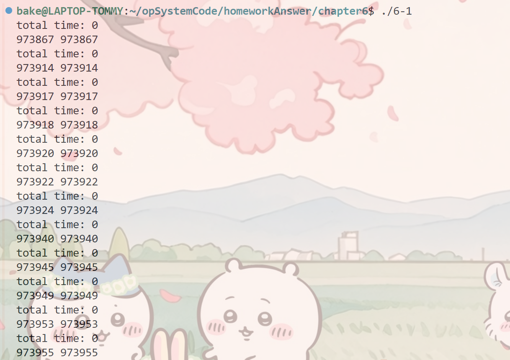
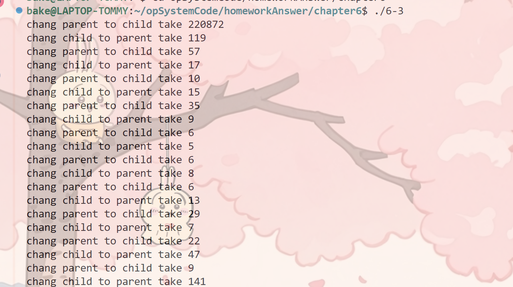

1.gettiomeofday()函数调用代码
        #include <stdio.h>
        #include <sys/time.h>

        int main(){
            struct timeval start,end;
            for (int t=0;t<12;t++){
                gettimeofday(&start,NULL);
                gettimeofday(&end,NULL);
                printf("total time: %ld\n",end.tv_usec-start.tv_usec);
                printf("%ld %ld\n",start.tv_usec,end.tv_usec);
            }
        }
运行结果：

说明系统调用很快,精度高可使用获取时间

2.系统调用时间测量
        #include <stdio.h>
        #include <unistd.h>
        #include <sys/time.h>
        #include <fcntl.h>
        #include <stdlib.h>

        int main(){
            int fd = open("./6-2.out",O_CREAT|O_RDONLY);
            char chu[25];
            struct timeval start,end;
            if (fd < 0){
                fprintf(stderr,"open failed.\n");
                exit(1);
            }
            for (int i=0;i<10;i++){
                gettimeofday(&start,NULL);
                read(fd,chu,3);
                gettimeofday(&end,NULL);
                printf("total time %ld\n",end.tv_usec-start.tv_usec);
            }
            close(fd);
            return 0;

        }
运行结果:

第一次运行比较慢,后面系统调用平均1微秒内
3.系统上下文切换测量
        #define _GNU_SOURCE
        #include <stdio.h>
        #include <stdlib.h>
        #include <string.h>
        #include <sys/time.h>
        #include <unistd.h>
        #include <sched.h>

        int main(){
            int oneCPU = 0;
            cpu_set_t  set;
            int pip1[2];
            int pip2[2];
            struct timeval start,end;
            char test[]={'h','e','l','l','p','\0'};

            int p1 = pipe(pip1);
            int p2 = pipe(pip2);

            if (p1<0 || p2<0){
                fprintf(stderr,"pipe faile");
                exit(1);
            }

            CPU_ZERO(&set);
            CPU_SET(oneCPU,&set);

            if (sched_setaffinity(getpid(),sizeof(set),&set)==-1){
                fprintf(stderr,"sched_setaffinity fail");
                exit(1);
            } else{
                int rc = fork();
                for(int i=0;i<10;i++){
                    if (rc < 0){
                    fprintf(stderr,"create fork fail");
                    exit(1);
                } else if (rc==0&&sched_setaffinity(rc,sizeof(set),&set)!=-1){
                    read(pip1[0],test,strlen(test));
                    gettimeofday(&end,NULL);
                    printf("chang parent to child take %ld\n",end.tv_usec-start.tv_usec);
                    gettimeofday(&start,NULL);
                    write(pip2[1],test,strlen(test));
                } else { // parent goes down
                    gettimeofday(&start,NULL);
                    write(pip1[1],test,strlen(test));
                    read(pip2[0],test,strlen(test));
                    gettimeofday(&end,NULL);
                    printf("chang child to parent take %ld\n",end.tv_usec-start.tv_usec);
                }
                }
            }

        }
运行结果：

一开始很长的切换时间是包含了系统调用，创建管道，写入管道等,完成冷启动后平均上下文切换5-6微秒