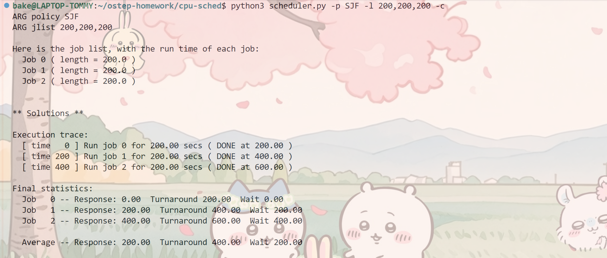
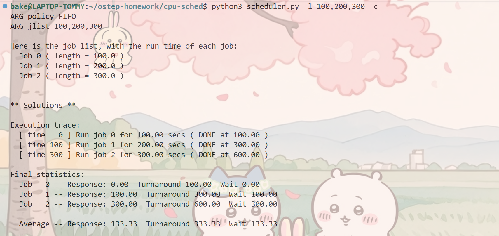
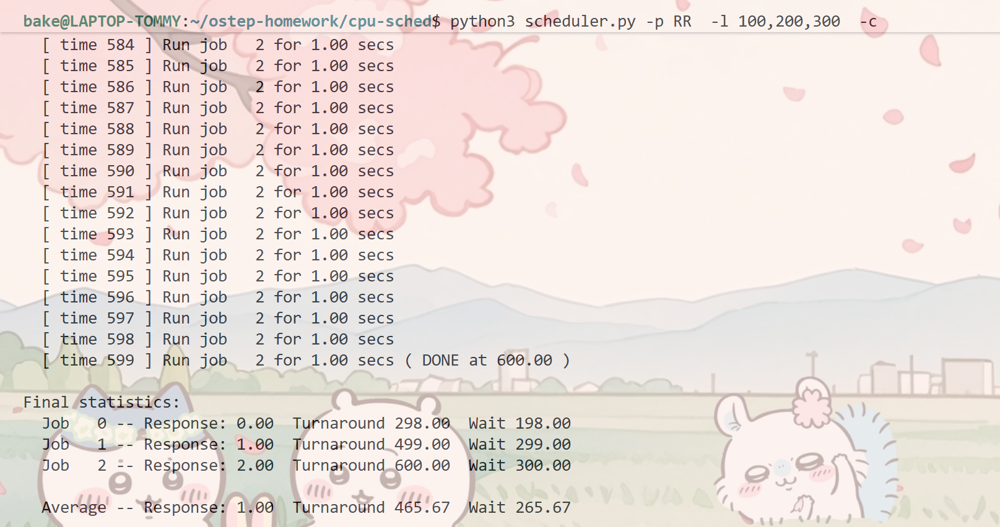
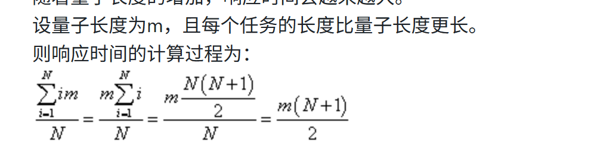

### 第一题运行结果

在相同任务时间的情况下使用SJF和FIFO调度程序时间是相同的
### 第二题运行结果

### 第三题运行结果

### 第四题：
长度更短的工作负载先到的情况下，SJF和FIFO相同的周转时间
### 第五题：
在长度更短的工作负载先到的情况下，量子长度大于最大负载时长的RR可看作的SJF;
### 第六题：
随着工作长度的增加，SJF的响应时间会增长
### 第七题：
随着量子长度的增加，RR的响应时间会增长；方程是

